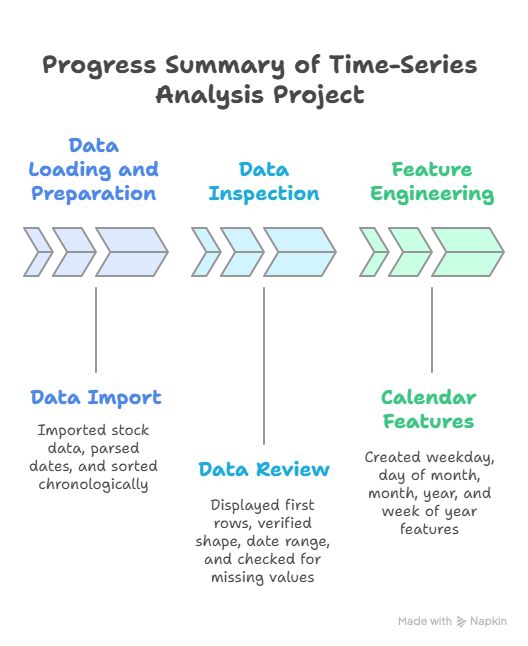
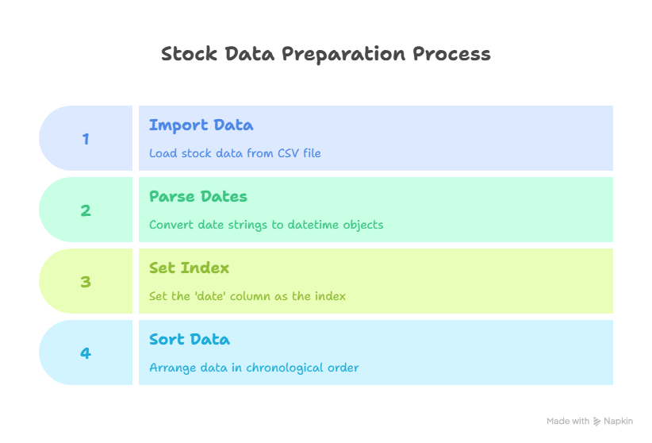
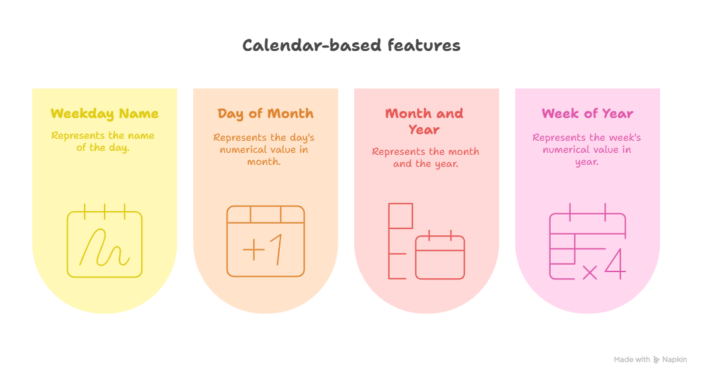

## Summary

So far in this time-series lab , the following steps have been completed:

1. **Data Loading and Preparation**:

2. **Data Inspection**:

3. **Feature Engineering**:
   - Created calendar-based features such as:
     - Weekday name
     - Day of the month
     - Month and year
     - Week of the year

